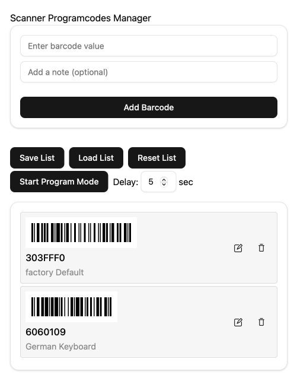
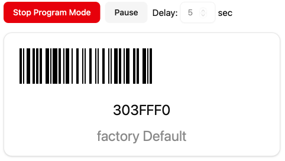

# Scanner Programmer

A comprehensive tool for programming scanner devices with advanced barcode management, sharing capabilities, and testing features. Use the camera or image upload functionality to quickly scan barcodes from manuals, or create lists manually for programming your scanner devices.

## Features

### Barcode Manager Mode

- **Create and manage barcode lists** for programming scanner devices
- **Multiple input methods**:
  - Manual entry with optional notes
  - **Camera-based scanning** using device camera
  - **Image upload** from device storage
  - **Clipboard image support** for pasting barcode images
- **Advanced barcode processing**:
  - Support for CODE128 control codes: `{FNC1}`, `{FNC2}`, `{FNC3}`, `{FNC4}`
  - Automatic barcode detection and decoding from images
- **List management**:
  - Drag and drop to reorder barcodes
  - Inline editing of values and notes
  - Save and load barcode lists as JSON files
  - **Share lists via URL** with compressed data for easy collaboration
- **Enhanced UI**:
  - Action buttons with intuitive icons (Save, Load, Share, Reset)
  - Visual feedback for all operations
  - Clean, responsive design
### Program Mode

- **Sequential barcode presentation** with configurable delay (1–30 seconds)
- **Automatic mode switching**: App automatically enters Program Mode when loading shared URLs or existing barcode lists
- **Keyboard blocking** during presentation to prevent interference
- **Visual barcode display** with clear, readable formatting
- **Delay control** for optimal scanner programming timing

### QR Test Mode

- **Generate QR codes** from arbitrary text input
- **Toggle interface**: Switch between input and view mode using icon buttons
- **Scanner output testing**: When viewing QR codes, all key presses are logged for testing scanner output
- **Special character handling**: Special keys shown as `<Esc=27>`, `<LF=10>`, etc.
- **Clean logging**: Shift key is ignored in the output log
- **Clear functionality**: Reset the key log with a trash icon button

### Sharing & Collaboration

- **URL sharing**: Share barcode lists via compressed URLs that can be opened by anyone
- **Automatic data loading**: Shared URLs automatically load and switch to Program Mode
- **Clipboard integration**: Share button copies URLs directly to clipboard
- **Data persistence**: Lists are saved to localStorage and restored on app reload
- **Cross-device compatibility**: Share lists between different devices and browsers

### General

- **Hamburger menu navigation**: Switch between Barcode Manager, Program Mode, and QR Test Mode
- **Responsive design**: Works seamlessly on desktop and mobile devices
- **Modern UI**: Built with shadcn/ui components and Tailwind CSS
- **Icon-enhanced interface**: Lucide React icons for improved usability and visual clarity

## Technical Implementation

### Architecture
- **Component separation**: Modular architecture with dedicated BarcodeManager and ProgramDisplay components
- **State management**: Shared state between components with proper data flow
- **Error handling**: Robust error handling with graceful fallbacks

### Data Management
- **URL compression**: LZ-String compression for sharing large barcode lists
- **Caching system**: Smart caching to handle React development mode constraints
- **Data integrity**: Maintains data consistency across component re-renders

### Testing & Development
- **Vitest 4.0+**: Modern testing framework with jsdom environment
- **TypeScript**: Full type safety throughout the application
- **ESLint**: Code quality and consistency enforcement




## Installation & Usage

### Prerequisites
- Node.js 18+ 
- pnpm package manager

### Setup
```bash
# Install dependencies
pnpm install

# Start development server
pnpm dev

# Build for production
pnpm build

# Run tests
pnpm test

# Run tests with UI
pnpm test:ui

# Generate coverage report
pnpm test:coverage
```

### Usage Examples

1. **Creating a barcode list**:
   - Switch to Barcode Manager mode
   - Add barcodes manually or use camera/image upload
   - Add optional notes for each barcode
   - Save your list for future use

2. **Programming a scanner**:
   - Load or create a barcode list
   - App automatically switches to Program Mode
   - Adjust delay if needed (1-30 seconds)
   - Present barcodes sequentially to your scanner

3. **Sharing lists**:
   - Click the Share List button
   - URL is automatically copied to clipboard
   - Recipients can open the URL to access the same barcode list

4. **Testing scanner output**:
   - Switch to QR Test Mode
   - Generate a test QR code
   - Scan with your device and observe the key output

## Technical Notes

### Barcode Support
- **CODE128 control codes**: Full support for `{FNC1}`, `{FNC2}`, `{FNC3}`, `{FNC4}` in scanner programming commands
- **Image processing**: Advanced barcode detection from uploaded images and camera input
- **Multiple formats**: Support for various barcode formats through ZXing library integration

### Platform Considerations
- **macOS clipboard**: Copying barcodes from PDFs in Preview may fail due to insufficient resolution in clipboard PNG fallback
- **Mobile compatibility**: Camera scanning works on mobile devices with camera access
- **Cross-browser**: Compatible with modern browsers supporting camera API

### Development Mode
- **React StrictMode**: Proper handling of development mode double execution
- **Hot reload**: Full support for Vite hot module replacement
- **Debug logging**: Comprehensive logging for troubleshooting URL data loading

## Dependencies

### Core Framework
- **React 19+**: Modern React with hooks and concurrent features
- **TypeScript**: Full type safety and developer experience
- **Vite 7+**: Fast development and optimized builds

### UI & Styling  
- **shadcn/ui**: Modern component library
- **Tailwind CSS 4+**: Utility-first styling
- **Lucide React**: Consistent icon system

### Barcode & Imaging
- **react-barcode**: Barcode generation and display
- **@zxing/library**: Barcode detection and decoding
- **Quagga**: Camera-based barcode scanning

### Utilities
- **LZ-String**: URL data compression
- **qrcode.react**: QR code generation

## Contributing

Contributions are welcome! This project follows modern React development practices with TypeScript and comprehensive testing.

### Development Setup
1. Fork the repository and create a new branch for your feature or fix
2. Install dependencies: `pnpm install`
3. Start development server: `pnpm dev`
4. Make your changes and add/update tests as needed
5. Run the test suite: `pnpm test`
6. Ensure code quality: `pnpm lint`
7. Build to verify: `pnpm build`
8. Open a pull request with a clear description

### Architecture Guidelines
- Follow the component separation pattern established in the codebase
- Maintain type safety throughout all components and utilities
- Add comprehensive error handling for new features
- Update documentation and requirements for significant changes

### Testing
- Write tests for new functionality using Vitest
- Ensure coverage for critical paths and error scenarios
- Test both development and production builds

For major changes or questions, please open an issue first to discuss your proposed changes.

Read [Copilot Instructions](.github/copilot-instructions.md) for detailed project architecture and development guidelines.

Thank you for helping make this project better!


## License

[MIT](./LICENSE) License © 2025 [Andreas Heissenberger](https://github.com/aheissenberger)
